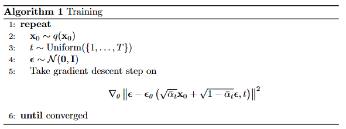

# basic knowledge

## Generative Model

> A generative model *learns* a **probability distribution** of the given dataset, so
> we can then sample from the distribution to create **new instances** of data.

## Distribution

Joint Distribution 联合分布

$$
\begin{equation}
P(X, Y)
\end{equation}
$$

Conditional Probability | Marginalizing 条件分布
$$
\begin{align}
&P(X) = \int{P(X, Y)dy} \\
&P[0<X<3 | Y>100]
\end{align}
$$

## Process

Forward process -> Add noise to pure noise (T = 1000)

Reverse process -> use Neural network to denoise

reference 1

>Ho, J.; Jain, A.; Abbeel, P. Denoising Diffusion Probabilistic Models.
In Proceedings of the Advances in Neural Information Processing Systems;
Curran Associates, Inc., 2020; Vol. 33, pp. 6840–6851.

### Comprehension

#### forward process

Add add Noise(Gaussian) by steps(T)
$$
\begin{equation}
q(\mathbf{x}_{1:T} | \mathbf{x}_0) := \prod_{t=1}^{T} q(\mathbf{x}_t | \mathbf{x}_{t-1}), \hspace{5mm}
q(\mathbf{x}_t | \mathbf{x}_{t-1}) := \mathcal{N}(\mathbf{x}_t;\sqrt{1-{\beta}_t}\mathbf{x}_{t-1},{\beta}_t\mathbf{I})
\end{equation}
$$

Another form of adding noise
$$
\begin{equation}
q(\mathbf{x}_t | \mathbf{x}_0) = \mathcal{N}(\mathbf{x}_t;\sqrt{\bar{\alpha}_t}\mathbf{x}_0,(1-\bar{\alpha}_t)\mathbf{I}), \hspace{5mm}
{\alpha}_t := 1 - {\beta}_t \ \  and \ \  \bar{\alpha}_t := \prod_{s=1}{t}{\alpha}_s
\end{equation}
$$

#### reverse process

$$
\begin{equation}
p_\theta(\mathbf{x}_{0:T}) := p(\mathbf{x}_T) \prod_{t=1}{T} p_\theta(\mathbf{x}_{t-1} | \mathbf{x}_t), \ \ \ p_\theta(\mathbf{x}_{t-1} | \mathbf{x}_t) := \mathcal{N}(\mathbf{x}_{t-1};\mu_\theta(\mathbf{x}_t, t), {\sum}_\theta(\mathbf{x}_t, t))
\end{equation}
$$

$ \mu_\theta(\mathbf{x}_t, t) $ and $ \sum_\theta(\mathbf{x}_t, t) $ is not know to us, so we should ***learn from data***

#### calculate problem

Just like a VAE, a latent variable model to accelerate.
$$
\begin{equation}
p_\theta(\mathbf{x}_0) := \int p_\theta(\mathbf{x}_{0:T})d \mathbf{x}_{1:T}
\end{equation}

$$

$ p_\theta(\mathbf{x}_0) $ called reverse process

#### Training performance

negative log likelihood

$$
\begin{equation}
\mathbb{E}\left[ - \log p_\theta (\mathbf{x}_0) \right] \leq \mathbb{E_q} \left[ - \log \frac{p_\theta(\mathbf{x}_{0:T})}{q(\mathbf{x}_{1:T} | \mathbf{x}_0)}  \right] = \mathbb{E} \left[ - \log p(\mathbf{x}_T) - \sum_{t \geq 1} \log \frac{p_\theta(\mathbf{x}_{t-1} | \mathbf{x}_t)}{q(\mathbf{x}_t | \mathbf{x}_{t-1})}  \right] =: L
\end{equation}
$$

### How to train

Pseudocode

take a sample from our dataset

### U-Net

classifier-free guidance

reference 2

> Ronneberger, O.; Fischer, P.; Brox, T. U-Net: Convolutional Networks for
Biomedical Image Segmentation. In Proceedings of the Medical Image Computing and
Computer-Assisted Intervention – MICCAI 2015; Navab, N., Hornegger, J., Wells,
W.M., Frangi, A.F., Eds.; Springer International Publishing: Cham, 2015; pp.
234–241.

### Latent Diffusion Model

reference 3

> Rombach, R.; Blattmann, A.; Lorenz, D.; Esser, P.; Ommer, B. High-Resolution Image Synthesis with Latent Diffusion Models 2022.
